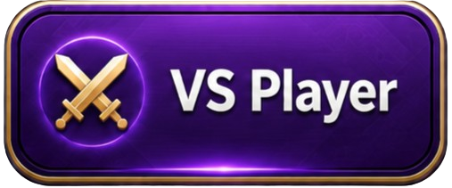
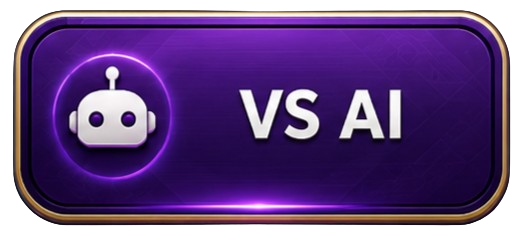

<div align="center">
    
</div>
<br />

# 🚀 The Game Overview

Migoyugo is an abstract strategy board game for two players that features complete information, meaning there is no reliance on luck or chance. Players compete to win the game by either creating an Igo, which is achieved by forming an unbroken line of 4 Yugos, or by accumulating a higher Yugo score if the game ends in a Wego.

<div align="center">
    
    
</div>

<br />

## The Board

The Migoyugo board is an 8 X 8 grid of 64 squares (typically all the same color) with rows numbered 1-8 from bottom to top and columns designated A-H from left to right
<br />

## The Migo

- White always moves first by placing a piece, called a Migo, on any square on the board
- Players take alternating turns placing Migos on any open square\* (see No Long Lines)
  <br />

## The Yugo

- When you form an unbroken line of exactly 4 pieces of your own color, or multiple intersecting lines (horizontal, vertical, or diagonal), the last piece placed becomes a Yugo. All Migos in the line(s) are removed, leaving only the Yugos, which can never be moved or removed
- Depending on the number of intersecting lines formed simultaneously by the last piece, the Yugo upgrades and scores as follows:

1. Single Yugo (1 line): Represented by a dot (•) in the center — worth 1 point

<div align="center">
    
</div>

2. Double Yugo (2 lines): Represented by an oval (⬭) in the center — worth 2 points

<div align="center">
    
</div>

3. Triple Yugo (3 lines): Represented by a triangle (▲) in the center — worth 3 points

<div align="center">
    
</div>

4. Square Yugo (4 lines: vertical, horizontal, and 2 diagonals): Represented by a square (■) in the center — worth 4 points

<div align="center">
    
</div>

- At no time may either player create an unbroken line of more than 4 in a row of any combination of Migos and/or Yugos of their own color (multiple intersecting lines are permitted)
  <br />

## 🏆 Winning

- There are two distinct end game conditions – an Igo and a Wego
- Form an unbroken line (horizontal, vertical or diagonal) of exactly 4 Yugos of your own color and you win instantly with an Igo
- If on your turn you are unable to make a legal move, or if all 64 squares are filled (and no Igo is achieved), the game ends with a Wego. The player with the highest total Yugo points wins. If points are tied, the game is a draw
- If a player resigns, the opponent is declared the winner
- If players compete using a clock, a player is declared the winner if the opponent's clock expires
  <br /> <br />

# ✨ Our Game Features

### 1. 👥 Vs Player Mode (Local Multiplayer)

<div align="center">
    
</div>

_Gather around and challenge your friends in real-time!_

- **Face-to-Face Battles:** Perfect for hangouts, parties, or casual meetups. No internet connection required for local play.
- **Same-Device Action:** Compete against your friend on the same screen with intuitive and responsive controls.
- **Bragging Rights:** Prove who is the ultimate champion in instant, high-stakes matches.

### 2. 🤖 Vs AI Mode (Single Player)

<div align="center">
    
</div>

_No friends around? No problem. Put your strategies to the test against our intelligent bot!_

- **Smart AI Companion:** Play against a finely-tuned AI designed to simulate human-like decision-making.
- **Skill Adaptation:** Perfect for beginners practicing the basics or veterans looking for a solid challenge.
- **Play Anytime, Anywhere:** Offline-friendly mode so you can sharpen your skills on the go.
  <br /><br />

# 🧠 AI Heuristic & Decision-Making Utilities

To power the **Vs AI Mode**, the game implements a Minimax-based heuristic evaluation function. This utility assigns strategic weight (scores) to every possible move on the board, allowing the AI to dynamically balance between **aggressive offense** (pursuing its own victory) and **solid defense** (blocking the player's winning moves).

The decision-making priority is governed by the following scoring weights:

- **Instant Win / Igo (`WIN_SCORE`):** The highest priority ($1,000,000,000$). Executed immediately when a winning move is detected.
- **Critical Defense (`BLOCK_IGO` / `BLOCK_SPECIAL_THREE_YUGO`):** Highly prioritized to prevent the player from achieving a winning condition (_Igo_ or powerful setups).
- **Tactical Offense (`DIRECT_SPECIAL_THREE_YUGO` / `DIRECT_YUGO`):** Calculated risks taken by the AI to build its own winning opportunities.
- **Self-Sabotage Avoidance (`OPEN_OPPONENT_IGO`):** A heavily penalized score to ensure the AI never accidentally opens up a winning path for the player during a _Yugo_ move.

## Heuristic Weight Configuration

Here is the core scoring utility used by the AI engine to evaluate board states:

```javascript
// High-priority Game States (Win/Loss Prevention)
const WIN_SCORE = 1_000_000_000; // Direct win or reaching Igo
const OPEN_OPPONENT_IGO = 950_000_000; // Penalty: Avoid giving opponent a winning opening
const BLOCK_IGO = 900_000_000; // Critical block against opponent's Igo

// Strategic & Tactical Formations
const BLOCK_SPECIAL_THREE_YUGO = 90_000; // Block dangerous setups before they expand
const DIRECT_SPECIAL_THREE_YUGO = 70_000; // Create setups that open win opportunities

// Basic Gameplay Formations
const DIRECT_YUGO = 7_500; // Score for standard Yugo formation
const BLOCK_YUGO = 7_000; // Score for blocking opponent's Yugo
```

## 🔍 Underlying Helper Functions Breakdown

The `HeuristicHelper` relies on several sub-functions to analyze specific grid patterns and return weights. Here is how each helper function contributes to the evaluation:

#### 1. `isBlockOpponentIgo()`

- **Purpose:** Evaluates if a specific cell is a critical defensive spot that must be blocked to prevent immediate defeat.
- **Return Value:** `1` if the opponent would win by placing a piece on this coordinate; `0` otherwise.

```gdscript
static func isBlockOpponentIgo(row, col, board, currentPlayer) -> int
```

#### 2. `isOpenOpponentIgo()`

- **Purpose:** Acts as a look-ahead blunder checker. It simulates the AI's move, then scans the entire board to see if that move accidentally opens up a winning opportunity for the opponent.
- **Return Value:** `1` if the move creates a fatal opening for the opponent `0` if the move is safe.

```gdscript
static func isOpenOpponentIgo(row, col, board, currentPlayer) -> int
```

#### 3. `totalBlockSpecialThreeYugo()`

- **Purpose:** Scans all 8 directions (`AXES`) using a secondary helper `isBlockingSpecialThreeThreat()` to check if the opponent is building a dangerous `XB XB B \_` setup.
- **Return Value:** An `int` representing the total number of advanced opponent setups blocked by this single move (e.g., `0`, `1`, or more if it blocks multiple intersecting lines).

```gdscript
static func totalBlockSpecialThreeYugo(row, col, board, currentPlayer) -> int
```

#### 4. `totalBlockedOpponentYugo()`

- **Purpose:** Checks if the targeted cell intercepts a standard line of 3 connected pieces that the opponent has already established.
- **Return Value:** An `int` representing the total number of standard Yugo paths blocked.

```gdscript
static func totalBlockedOpponentYugo(row, col, board, currentPlayer) -> int
```

#### 5. `totalDirectSpecialThreeYugo()`

- **Purpose:** Evaluates offensive capability. It loops through all axes using `hasDirectXThreeIncludingCell()` to check if placing a piece here completes a powerful trio of Special Tokens (`XB XB XB`).
- **Return Value:** `int` representing how many active Special Three setups the AI creates with this move.

```gdscript
static func totalDirectSpecialThreeYugo(row, col, board, currentPlayer) -> int
```

#### 6. `isYugo()`

- **Purpose:** Validates whether the tile contains the current player's piece after the move simulation, scoring a basic successful formation.
- **Return Value:** `1` if the condition is met `0` otherwise.

```gdscript
static func isYugo(row, col, board, currentPlayer) -> int
```

#### 7. `isYugo()`

- **Purpose:** A quick validator utility that checks if a simulated move result has produced a definitive winner.
- **Return Value:** `1` if a winner is found (game over condition) `0` if the game is still ongoing.

```gdscript
static func isIgo(result) -> int
```

<br/> <br/>

# 🛠️ AI Debugging & Configuration Guide

This project features an advanced AI engine powered by the **Minimax Algorithm**. To facilitate optimization, tweaking, and debugging, you can control the AI's behavior and visualize its decision tree using the configurations found in `constants/ai_constants.gd`.

---

## ⚙️ Core AI Configurations

Open `constants/ai_constants.gd` to modify the following developer constants:

```gdscript
const MAX_DEPTH = 5
const TOP_K = 3
const DEBUG_MINIMAX = false
```

#### 1. MAX_DEPTH (Search Depth)

- **What it does**: Controls how many turns into the future the AI will look ahead.

- **Impact**: A higher value (e.g., 5 or more) makes the AI incredibly smart and strategic, but increases computation time exponentially.

- A lower value makes the AI respond instantly but with less foresight.

#### 2. TOP_K (Move Pruning/Beam Search)

- **What it does**: Limits the number of best candidate moves evaluated at each level of the Minimax tree.

- **Impact**: Instead of checking all empty tiles on the board, the AI only considers the top 3 highest-scoring moves (pre-evaluated by HeuristicHelper). This keeps the engine highly optimized and prevents performance lag at deeper layers.

#### 3. DEBUG_MINIMAX (Trace Logger)

- **What it does**: Toggles the diagnostic logging system for the evaluation tree.

- **Impact**: When set to true, the console will output a structured trace log of every single state evaluated by the Minimax algorithm.

## 🪵 How to Debug and Visualize the AI Decision Tree

We have included a built-in visualizer tool to help you inspect how the AI evaluates scores and chooses its path.

- **Step 1**: Enable Debug Logs
  Set DEBUG_MINIMAX to true in constants/ai_constants.gd:

```gdscript
const DEBUG_MINIMAX = true
```

- **Step 2**: Run the Game and Capture Logs
  Start the game in Vs AI Mode and make a move.
  Look at your Godot Output / Terminal console. You will see a structured trace log bounded by equal sign borders (=), resembling something like this:

```
========================================
MINIMAX TRACE START
Depth: 0 | Player: AI | Move: (3, 4) | Score: 7500
Depth: 1 | Player: Human | Move: (3, 5) | Score: -7000 br
...
MINIMAX TRACE END
========================================
```

- **Step 3**: Visualize with minimax_trace.html
  To convert the raw text logs into an interactive tree diagram:
  - Copy the entire log content inside the execution boundaries from your console.
  - Locate and open the minimax_trace.html file in your web browser.
  - Paste your copied log into the provided text area inside the HTML tool.

- **Click Render/Generate Tree.**
- The tool will dynamically parse the log strings and draw an interactive Minimax Decision Tree, allowing you to see exactly which paths were chosen, pruned, or penalized based on your heuristic helper scores!
