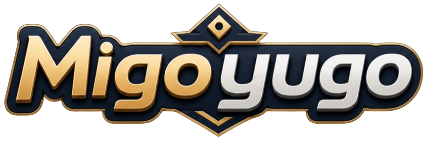
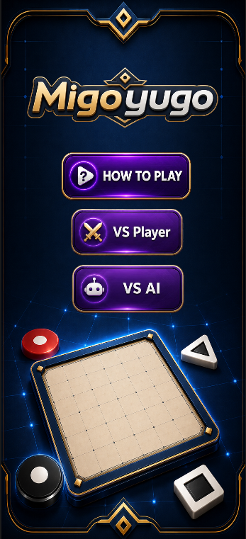
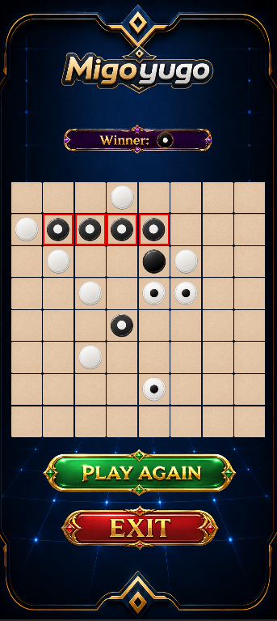
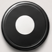
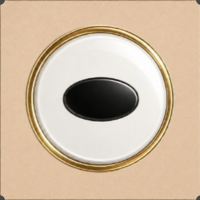
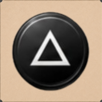
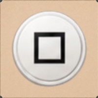

    

 

# The Game Overview

Migoyugo is an abstract strategy board game for two players that features complete information, meaning there is no reliance on luck or chance. Players compete to win the game by either creating an Igo, which is achieved by forming an unbroken line of 4 Yugos, or by accumulating a higher Yugo score if the game ends in a Wego.

    
    

 

## The Board

The Migoyugo board is an 8 X 8 grid of 64 squares (typically all the same color) with rows numbered 1-8 from bottom to top and columns designated A-H from left to right
 

## The Migo

- White always moves first by placing a piece, called a Migo, on any square on the board
- Players take alternating turns placing Migos on any open square\* (see No Long Lines)
   

## The Yugo

- When you form an unbroken line of exactly 4 pieces of your own color, or multiple intersecting lines (horizontal, vertical, or diagonal), the last piece placed becomes a Yugo. All Migos in the line(s) are removed, leaving only the Yugos, which can never be moved or removed
- Depending on the number of intersecting lines formed simultaneously by the last piece, the Yugo upgrades and scores as follows:

1. Single Yugo (1 line): Represented by a dot (•) in the center — worth 1 point

    

2. Double Yugo (2 lines): Represented by an oval (⬭) in the center — worth 2 points

    

3. Triple Yugo (3 lines): Represented by a triangle (▲) in the center — worth 3 points

    

4. Square Yugo (4 lines: vertical, horizontal, and 2 diagonals): Represented by a square (■) in the center — worth 4 points

    

- At no time may either player create an unbroken line of more than 4 in a row of any combination of Migos and/or Yugos of their own color (multiple intersecting lines are permitted)
   

## Winning

- There are two distinct end game conditions – an Igo and a Wego
- Form an unbroken line (horizontal, vertical or diagonal) of exactly 4 Yugos of your own color and you win instantly with an Igo
- If on your turn you are unable to make a legal move, or if all 64 squares are filled (and no Igo is achieved), the game ends with a Wego. The player with the highest total Yugo points wins. If points are tied, the game is a draw
- If a player resigns, the opponent is declared the winner
- If players compete using a clock, a player is declared the winner if the opponent's clock expires
   

# Our Game Features
